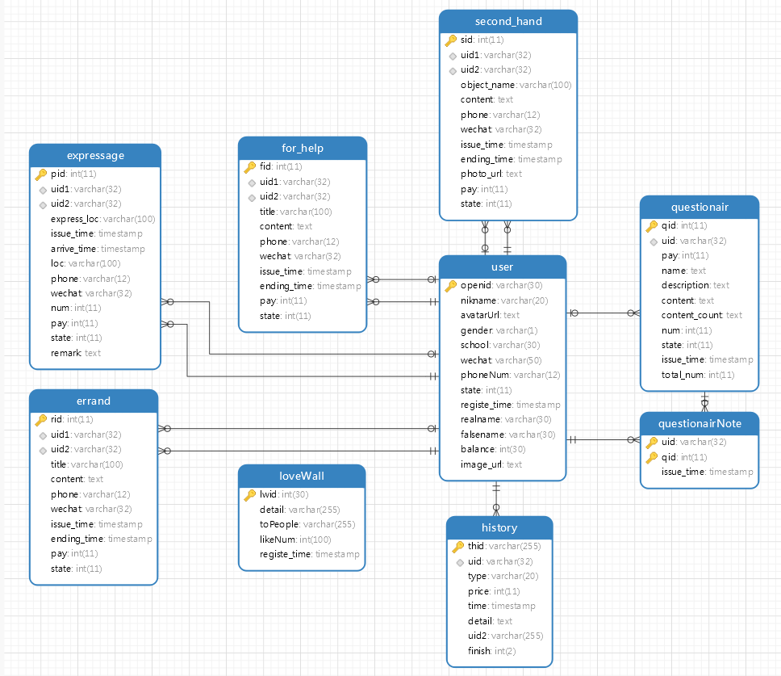
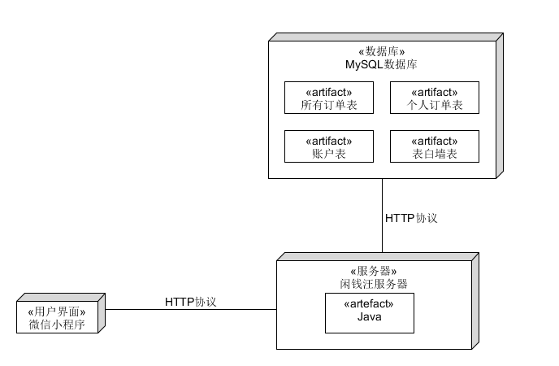
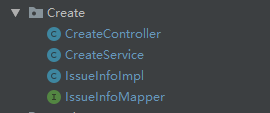
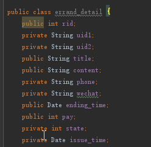
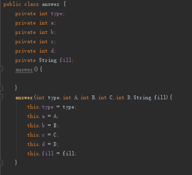
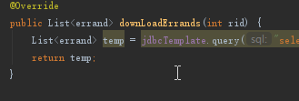

[TOC]

### 一、项目环境

* 服务器 操作系统：**补充**
* 客户端：微信小程序

### 二、项目构建和管理工具

* 构建 
* 管理 采用GitHub管理平台托管代码

### 三、技术选型

本产品使用“微信小程序”作为用户交互方式，使用Java Spring boot 作为后端开发的框架，服务端使用 MySQL 数据库作为存储媒介，Redis数据库作为内存数据库。整体架构是MVC架构，服务端还使用了面向服务的架构（微服务架构），使用面向对象编程。

#### 理由

##### 开发微信小程序

- 小程序是一种不需要下载安装即可使用的应用，它实现了应用**“触手可及”**的梦想，用户扫一扫或者搜一下即可打开应用。也体现了**“用完即走”**的理念，用户不用关心是否安装太多应用的问题。应用将无处不在，随时可用，但又无需安装卸载。
- 对于开发者而言，小程序开发门槛相对较低，难度不及APP，能够满足简单的基础应用，适合生活服务类线下商铺以及非刚需低频应用的转换。
- 对于个人或创业团队而言，微信小程序的推广成本低，传播性广，微信的10亿用户都将是好的微信小程序的潜在用户。

##### 使用Spring boot

**Spring Boot** 集成了大量常用的第三方库配置，Spring Boot应用中这些第三方库几乎可以是零配置的**开箱即用（out-of-the-box）**，大部分的 Spring Boot 应用都只需要非常少量的配置代码（基于 Java 的配置），开发者能够更加专注于业务逻辑。Spring boot 有以下优点：

- 简化编码：Spring Boot 帮助开发着快速启动一个 web 容器，在 Spring Boot 中，我们只需要在 pom 文件中添加依赖即可。
- 简化配置：Spring Boot 采用 Java Config 的方式对 Spring 进行配置。对于一个普通的类，只需要@Configuration 和@Bean两个注解即可使它也成为一个 Bean 让 Spring 去管理
- 简化部署：Spring Boot 内嵌了 tomcat，我们只需要将项目打成 jar 包，使用启动指令即可一键式启动项目。服务端的运行环境需求也很低，仅需要有JDK即可

##### 使用 MySQL 数据库

- **开源**
- **简单易用** ：MySQL 是一个高性能且相对简单的数据库系统，与一些更大系统的设置和管理相比，其复杂程度较低
- **可移植性** ：MySQL 可运行在各种版本的 UNIX 以及其他非 UNIX 的系统，可移植性强
- **速度** ：MySQL 运行速度很快。开发者声称 MySQL 可能是目前能得到的最快的数据库。

##### 使用Redis数据库

本产品使用Redis主要是用于用户会话状态的维护，因为用户会话频繁且速度要求高，而Mysql数据库的数据存储于硬盘中，从硬盘频繁读取数据本身就是一件不合理的事情，而且性能和效率都不高，因此我们使用了redis 内存数据库

##### 使用MVC架构

- 低耦合性
  视图层和业务层分离，这样就允许更改视图层代码而不用重新编译模型和控制器代码，同样，一个应用的业务流程或者业务规则的改变只需要改动MVC的模型层即可。因为模型与控制器和视图相分离，所以很容易改变应用程序的数据层和业务规则。
- 高重用性和可适用性
  随着技术的不断进步，现在需要用越来越多的方式来访问应用程序。MVC模式允许你使用各种不同样式的视图来访问同一个服务器端的代码。它包括任何WEB（HTTP）浏览器或者无线浏览器（wap），比如，用户可以通过电脑也可通过手机来订购某样产品，虽然订购的方式不一样，但处理订购产品的方式是一样的。由于模型返回的数据没有进行格式化，所以同样的构件能被不同的界面使用。例如，很多数据可能用HTML来表示，但是也有可能用WAP来表示，而这些表示所需要的命令是改变视图层的实现方式，而控制层和模型层无需做任何改变。
- 较低的生命周期成本
  MVC使开发和维护用户接口的技术含量降低。
- 快速的部署
  使用MVC模式使开发时间得到相当大的缩减，它使程序员（Java开发人员）集中精力于业务逻辑，界面程序员（HTML和JSP开发人员）集中精力于表现形式上。
- 可维护性
  分离视图层和业务逻辑层也使得WEB应用更易于维护和修改。
- 有利于软件工程化管理
  由于不同的层各司其职，每一层不同的应用具有某些相同的特征，有利于通过工程化、工具化管理程序代码。

##### 使用微服务架构

- 因为有两位后端开发人员，且负责不同的模块，为了避免后期整合增加的工作量，我们使用微服务的架构和设计理念，即双方通过调用接口来实现程序的完整性，而非将代码整合在一起。通过运行开发和运行多个小的程序模块，来实现产品的功能扩展，提高了平台的可扩展性和可维护性。

### 四、架构设计

本项目的目录结构如下：

```

```

业务逻辑架构图：


### 五、模块划分与设计

#### 系统整体模块图

本项目系统总体由登录模块、发布订单模块、接收订单模块、订单管理模块、用户模块、表白墙模块这六大模块组成。

##### 1.登录模块划分

##### 2.订单发布模块划分

##### 3.接收订单模块划分

##### 4.订单管理模块划分

##### 5.用户模块划分

##### 6.表白墙模块划分

### 六、数据库设计

### 数据库设计原则：

​	一个好的数据库产品并不等于就是有一个好的应用系统，假设不能设计一个逻辑合理的数据库模型，不仅仅会增加程序客户端和服务器端的编程与维护的难度，而且还会大大影响系统在实际操作运行的性能。

数据库设计的两种方法:

​	(1)面向数据:以信息需求为主，同时兼顾处理需求;

​	(2)面向过程:以处理需求为主，同时兼顾信息需求。

​	数据库设计是建立数据库和应用系统的核心和基础，它要求对于一个给定的应用环境，构造最优的数据库模式，建立一个数据库应用系统，该系统可以有效地存储数据，满足用户的应用需求。

### 数据库 E-R 图：



### 七、路由设计

#### 1.返回状态码

|        类型         | stateCode |   info   |
| :-----------------: | :-------: | :------: |
|    请求操作成功     |    200    |   NULL   |
| 成功GET且文件未改变 |    304    |   NULL   |
|    数据格式错误     |    400    |   NULL   |
|        错误         |    500    | 错误信息 |

#### 2. 路由表格

| 路由 |         方法          |    说明     | 测试 |
| :--: | :-------------------: | :---------: | :--: |
|PUT | /Modified/AcceptIssue  |		AcceptIssue |OK|
|PUT |  /Modified/DeleteIssue | 		DeleteIssue |OK|
|PUT |/Modified/FinishIssue		|FinishIssue |OK|
|GET |/Create/DeleteQuestionair	|	删除问卷 |OK|
|GET |/Create/downLoadQuestionair |	downLoadQuestionair |OK|
|GET |/Create/EndQuestion |用户终止订单，用户收集到足够多的订单后，终止问卷 |OK|
|POST| /Create/Errand |CreateErrand |OK|
|POST| /Create/Expressage| CreateExpressage |OK|
|POST| /Create/fill |                     填写问卷                     |OK|
|POST| /Create/For_help |CreateFor_help |OK|
|GET |/Create/getQuestionairContent| getQuestionairContent |OK|
|GET |/Create/LoadMyQuestionair |LoadMyQuestionair |OK|
|POST |/Create/Login |Login |OK|
|GET |/Create/OnLoadQuestionair| OnLoadQuestionair |OK|
|POST |/Create/questionair |create |OK|
|POST|/Create/Second_hand |CreateSecond_hand |OK|
|POST |/Create/User |CreateUser |OK|
|GET |/Create/viewAll| 发布者获取问卷填写统计：人数，内容统计等 |OK|
|GET |/forever/cc |foreverSession |OK|
|GET |/Load/Contact_way |getContact |OK|
|GET |/Load/Creation| LoadMyCreation |OK|
|GET| /Load/downLoadErrands |downLoadErrands |OK|
|GET| /Load/downLoadExpressage |downLoadExpressage |OK|
|GET |/Load/downLoadFor_help |downLoadFor_help |OK|
|GET |/Load/downLoadSecond_hand |downLoadSecond_hand |OK|
|GET |/Load/OnLoadErrands |OnLoadErrands |OK|
|GET |/Load/OnLoadExpressage| OnLoadExpressage |OK|
|GET |/Load/OnLoadFor_help |OnLoadFor_help |OK|
|GET |/Load/OnLoadSecond_hand| OnLoadSecond_hand |OK|
|GET |/Load/Receiving |LoadMyReceiving |OK|

#### 3.API示例说明—用户创建问卷

**3.1.应用场景**

用户在订单页面选择自己想要接受的订单

**3.2.接口示例**

https://moneydog.club:3030/Create/questionair

**3.3.是否需要证书**

需要

**3.4.请求参数**

| 字段名 | 变量名 | 必填 | 类型 | 示例值 | 描述 |
| ------ | ------ | ---- | ---- | ------ | ---- |
| 题目内容 | content | 是| string| [{"type":0,"title":"对饭堂的满意度","a":"不满意","b":"一般","c":"较满意","d":"满意"},{"type":1,"title":"喜欢窗口","a":"不满意","b":"一般","c":"较满意","d":"满意"},{"type":2,"title":"对饭堂的建议","a":"","b":"","c":"","d":""}] | 问卷题目 |
| 问卷初始化统计 | content_count |是|string|{"content_count":[                  {"type":0,"a":0,"b":0,"c":0,"d":0,"fill":""},{"type":1,"a":0,"b":0,"c":0,"d":0,"fill":""},{"type":2,"a":0,"b":0,"c":0,"d":0,"fill":""}]                                          }| 问卷统计 |
|描述|description|否|string| 饭堂满意度调查                                               |描述|
|问卷名称|name|是|string| 饭堂满意度调查                                               |问卷名称|
|单价|pay|是|int|1|单价|
|总数|total_num|是|int|100|总是|

**3.5.举例如下**

```
Menu {
content:[{"type":0,"title":"对饭堂的满意度","a":"不满意","b":"一般","c":"较满意","d":"满意"},{"type":1,"title":"喜欢窗口","a":"不满意","b":"一般","c":"较满意","d":"满意"},{"type":2,"title":"对饭堂的建议","a":"","b":"","c":"","d":""}],
content_count:{"content_count":[                  {"type":0,"a":0,"b":0,"c":0,"d":0,"fill":""},{"type":1,"a":0,"b":0,"c":0,"d":0,"fill":""},{"type":2,"a":0,"b":0,"c":0,"d":0,"fill":""}]
},
description:饭堂满意度调查,
name:饭堂满意度调查,
pay:1
total_num:100
 } 
```

**3.6.返回结果**

|   字段名   | 变量名 | 必填 |    类型     | 示例值  |       描述       |
| :--------: | :----: | :--: | :---------: | :-----: | :--------------: |
| 返回状态码 | result |  是  | JSON String | SUCCESS | 接受订单操作成功 |

### 八、功能模型及用例设计


### 九、逻辑视图

我们的闲钱汪系统采用的是经典的分层架构，主要分为UI层，业务层以及数据层


### 十、物理视图



### 十一、技术备忘录

**架构问题：可用性——订单被接单后发布者无法取消或者接单者无法取消接单**

* 解决方案：在前端部分为已被接单的订单提供一个取消按钮，无论是发布者还是接单者选择取消后，便给另一方发送请求取消信息，等另一方同意后便可成功取消订单

* 动机：生活总是有许多变化，方便用户取消才能使用户更满意。

### 十二、设计技术

- mvc架构

  view 是指前端，后端的接口开发使用Contorller作为控制器，调用service，接口的implement与service 分离使代码更具维护性

  位置：`code\moneydog\BackEnd\BackEnd1\src\main\java\backend1\demo`

  

- 面向服务的架构（微服务）

  因为有两位后端开发人员，且负责不同的模块，为了避免后期整合增加的工作量，我们使用微服务的架构和设计理念，即双方通过调用接口来实现程序的完整性，而非将代码整合在一起。通过运行开发和运行多个小的程序模块，来实现产品的功能扩展，提高了平台的可扩展性和可维护性。

  位置：`code\moneydog\BackEnd\BackEnd1\src\main\java\backend1\demo\CreateController` 334 行

  

- 面向对象编程

  程序多处使用类和类对象，实现面向对象编程， 提高代码的可重用性和可维护性

  位置：`code\moneydog\BackEnd\BackEnd1\src\main\java\backend1\demo\`

  - errand_detail.class  

   

  - answer.class 

  

  - LoadImpl.class   25 行:

    